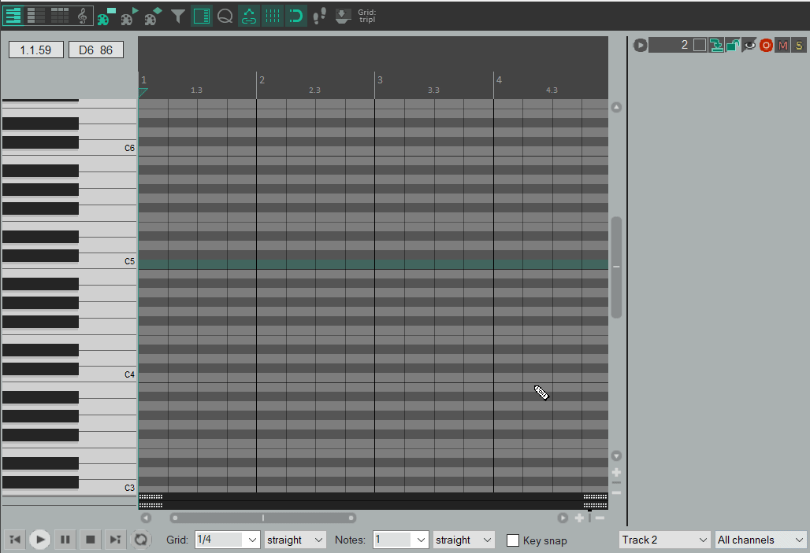

# STUTTERINO: MIDI NOTE REPEATER

Stutterino is a MIDI plugin meant as an aid for composing glitchy music.

## INTENDED USAGE
Stutterino facilitates the creation of [snare rushes](https://en.wikipedia.org/wiki/Snare_rush): 

Add a single note in the MIDI editor and an instance of Stutterino before your instrument plugin of choice, then tweak the number, length and skew of repetitions through the plugin parameters.

<strong>BEWARE!</strong> The MIDI note off message is overriden by the plugin instance, so the note length won't be the same as the one painted in the MIDI editor.

Stutterino can also modify the midi pitches of subsequent repetitions.

## ROADMAP
- Add some kind of optional parameters randomization;
- Add tabs so that the plugin can store multiple states that can be selected through automation items;

## CREDITS
- [alata font by Spyros Zevelakis / Eben Sorkin](https://www.fontsquirrel.com/fonts/alata);
- Stutterino was made with the [JUCE framework](https://juce.com/);